# Trimap Synthesis with a Conditional Adversarial Network

Trimap generation through a cGAN net, based on the architecture [pix2pixHD](https://github.com/NVIDIA/pix2pixHD), given an input image containing a person. This trimap could be use as an input for the Information Flow Matting algorithm, thus obtaining an alpha channel for the person.

## Results obtained for the synthetic composite test set

Test dataset based on the [Adobe Dataset](https://sites.google.com/view/deepimagematting) for background-matting. The results showed were obtained for the 200th epoch.

Input | Output| Groundtruth|
:----:|:-----:|:-----------:
|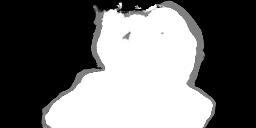| 
|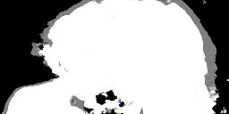| 
|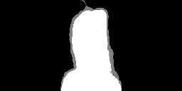| 
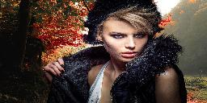|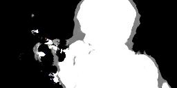| 
|| 
|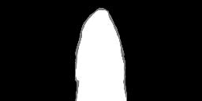| 
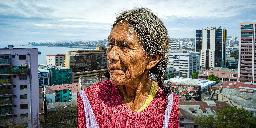|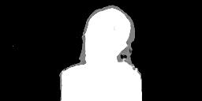| 
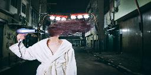|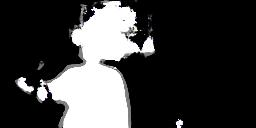| 

## Results obtained for the natural composite test set

This dataset was tailored for this test. The background of each image is not a product of a computational composition. Images copyright goes to their respective owners. The results showed were obtained for the 200th epoch.

Input | Output| Groundtruth|
:----:|:-----:|:-----------:
|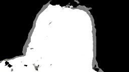| 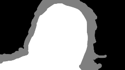
|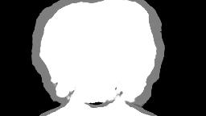| 
|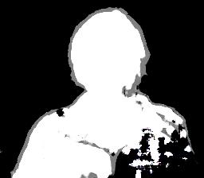| 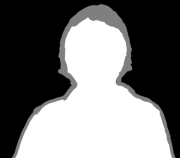
|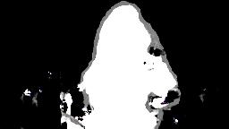| 

### Prerequisites
 - 
