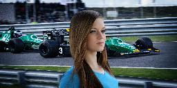
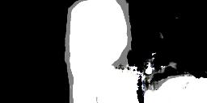
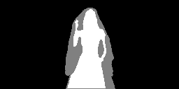
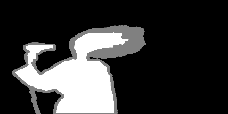
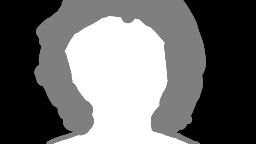
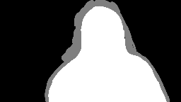

# Trimap Synthesis with a Conditional Adversarial Network

Trimap generation through a cGAN net, based on the architecture [pix2pixHD](https://github.com/NVIDIA/pix2pixHD), given an input image containing a person. This trimap could be use as an input for the Information Flow Matting algorithm, thus obtaining an alpha channel for the person.

## Results obtained for the synthetic composite test set

Test dataset based on the [Adobe Dataset](https://sites.google.com/view/deepimagematting) for background-matting. The results showed were obtained for the 200th epoch.

Input | Output| Groundtruth|
:----:|:-----:|:-----------:
|| 
|| 
|| 
|| 
|| 
|| 
|| 
|| 

## Results obtained for the natural composite test set

This dataset was tailored for this test. The background of each image is not a product of a computational composition. Images copyright goes to their respective owners. The results showed were obtained for the 200th epoch.

Input | Output| Groundtruth|
:----:|:-----:|:-----------:
|| 
|| 
|| 
|| 

## Getting Started

### Prerequisites
- Linux or macOS
- Python 3.X
- NVIDIA GPU __*__ (At least 4Gb of VRAM) + CUDA cuDNN

__*Note:__ Even thought we tested and trained the network with a GPU of this characteristics, the authors of the model recommend a more powerful option for improved results, at least a GPU with 11 Gb of VRAM.

### Installation
- Follow the **Installation instructions** from the [NVIDIA repository](https://github.com/NVIDIA/pix2pixHD#installation)

- Search inside the cloned repository folder __pix2pixHD__, for the `train.py` file and replace it with the one found in this repository [here](train.py). This fixes some broken and old dependencies.

- Download the weights for the trained model (G and D nets) from our [Drive folder](https://drive.google.com/drive/folders/161S-NxOAmuIfHN-Ol2osE6sYp45fZHUK?usp=sharing). After download, create the following folder structure `pix2pixHD/checkpoints/w` and place the files inside `w`. The result structure should look like this:
	```
		pix2pixHD/
			checkpoints/
				w/
					200_net_D.pth
					200_net_G.pth
	```
- At this point the network should be installed!

### Testing and Training

In the folder `scripts` we provided useful scripts for performing this tasks. Copy the contents of this folder in the root directory `pix2pixHD/`.

#### Testing

We included a test [dataset](datasets/) `test_dataset.zip`, download this file and extract it inside the `pix2pixHD/datasets/` folder. To initiate the test, from the root folder, call the testing routine:
```
$ ./test.sh
```
The results will be stored in the `pix2pixHD/results` folder

#### Training

To train the net with your own dataset, create two folders inside `pix2pixHD/datasets/w/` called `train_A` and `train_B`. Inside the first folder the input images are placed and in the second folder, the expected result for the input images. Files names should correspond between folders i.e.
```
train_A/
	0.png # A photo to extract a trimap from

train_B/
	0.png # The expected trimap
```

To start the training, call the following routine:
```
$ ./train.sh
```

**Note:** We provide a useful python script for expanding the dataset: [`moreData.py`](datasets/moreData.py)

#### Continue training

The steps are basically the same that for training, place the dataset in the corresponding folders. To continue training called the following routine:
```
$ ./continue_train.sh
```

**Note:** For default this routine will continue training from the last epoch that is provided in the Drive Folder (200th epoch).

#### Evolution of the net

In this [link](https://htmlpreview.github.io/?https://github.com/Wauro21/gan_trimap/blob/main/docs/index.html) it's possible to see the evolution of the net during the training epochs. An html page was generated to aid in the visualization.

#### Utils: Upscaling

As the network works with a rather small resolution, we provide a python script: [`upscaling.py`](upscaling/upscaling.py), that takes the original input image and scales the resulting trimap extracted from the net, to needed dimensions:

I/O | Image |
:----:|:-----:|
Input | 
Net trimap | 
Upscaled | 
